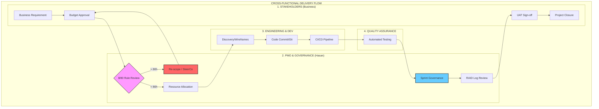

## 🗺️ Process Mapping & Efficiency

### 🌊 Value Stream Mapping (VSM)
I utilize VSM to identify **Non-Value-Added (NVA)** steps in the software delivery lifecycle.
* **Goal:** Reduce "Lead Time" from Requirement Discovery to Production Commit.
* **Focus:** Identifying bottlenecks in the validation iterations to increase velocity.

### 🏊 Swimlane (Cross-Functional) Diagram
Used to clarify hand-offs between departments:
* **Lane 1 (Stakeholders):** Business Requirements & UAT.
* **Lane 2 (PMO/Hasan):** 8/80 Governance & Resource Coordination.
* **Lane 3 (Engineering):** Code Development & Unit Testing.
* **Lane 4 (QA):** Final Validation & SLA Verification.

### 📈 Control Charts
Used to monitor process stability (e.g., tracking the number of bugs per sprint). If a data point falls outside **Upper/Lower Control Limits**, I initiate a **Fishbone RCA**.
