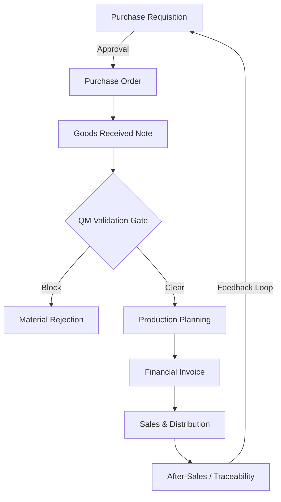

# Supply Chain Traceability & JIT Governance
## The "Physical-to-Digital" Framework

### 0. The Procurement Lifecycle
Traceability begins before the goods arrive. By governing the transition from **Purchase Requisition (PR)** to **Purchase Order (PO)**, we ensure:
* **Budget Alignment:** No technical procurement occurs without verified cost-center approval.
* **Demand Accuracy:** Requisitions are cross-referenced against **Master Planning** requirements to prevent over-ordering (JIT Principle).

### 1. Overview
In high-volume manufacturing environments, the **Goods Received Note (GRN)** is the critical trigger for the entire ERP ecosystem. This framework ensures that physical inventory movements are reconciled with **D365/SAP** ledgers to maintain **ISO 9001** compliance and **Master Planning (MRP)** accuracy.

---

### 2. The 7-Tier Validation Logic (GRN Gatekeeper)
To ensure "Day 1" data integrity, every inbound/outbound movement follows this validation sequence:

| Tier | Validation Level | Technical Checkpoint | Goal |
| :--- | :--- | :--- | :--- |
| **1** | **Physical Count** | Warehouse Floor Verification | Quantity match vs. Packing Slip. |
| **2** | **SKU Mapping** | ERP Item Record Match | Ensure no "Ghost Items" enter the system. |
| **3** | **Quality Gate (QM)** | Inspection Status Check | GRN blocked from Production until QM release. |
| **4** | **JIT Reconciliation** | Master Planning Sync | Update MRP to reflect new "On-Hand" availability. |
| **5** | **Batch/Lot Trace** | ISO Traceability | Unique identifier link for "Cradle-to-Grave" audit. |
| **6** | **Financial Post** | Accrued Liability Check | Auto-triggering the preliminary ledger entry. |
| **7** | **Final Put-away** | WMS Bin Accuracy | Finalizing the digital location of physical stock. |

---

### 3. Functional Architecture
The following diagram illustrates how the GRN acts as the central pivot point between Logistics, Quality, and Production Planning.

---
    
